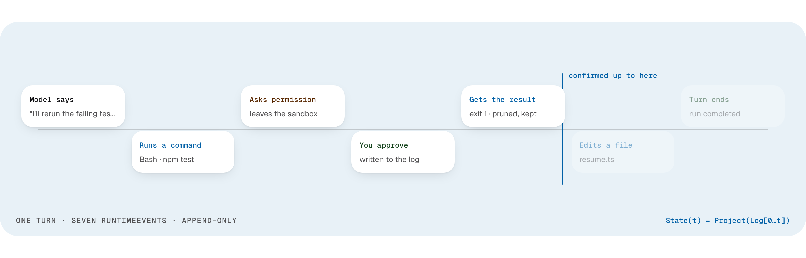

<!--
  Licensed to the Apache Software Foundation (ASF) under one
  or more contributor license agreements.  See the NOTICE file
  distributed with this work for additional information
  regarding copyright ownership.  The ASF licenses this file
  to you under the Apache License, Version 2.0 (the
  "License"); you may not use this file except in compliance
  with the License.  You may obtain a copy of the License at

      http://www.apache.org/licenses/LICENSE-2.0

  Unless required by applicable law or agreed to in writing,
  software distributed under the License is distributed on an
  "AS IS" BASIS, WITHOUT WARRANTIES OR CONDITIONS OF ANY
  KIND, either express or implied.  See the License for the
  specific language governing permissions and limitations
  under the License.
-->

<h1 align="center">
   Apache Maka (Incubating)
</h1>

<h3 align="center">Apache Maka (Incubating) is a high-performance agent workspace that keeps a complete record of everything it did.</h3>

<p align="center">
  <a href="https://maka.apache.org/en/">Website</a> ·
  <a href="./docs/README.md">Documentation</a> ·
  <a href="https://maka.apache.org/en/downloads/">Download</a> ·
  <a href="./README.zh-CN.md">中文文档</a>
</p>

<p align="center">
  <a href="https://github.com/apache/maka/stargazers"></a>
  <a href="./LICENSE"></a>
  
</p>

<picture>
  <source media="(prefers-color-scheme: dark)" srcset="./.github/assets/readme-hero.en.dark.png" />
  
</picture>

## What Maka is

An agent harness exists to finish tasks. We hold it to one measure: how many it completes and at what cost. We publish every run: same model, same official verifier, full per-task record.

- **Measured, not claimed.** Maka is benchmarked against other harnesses on the same model with the official verifier, and the per-task results ship with every report in [`docs/eval/`](./docs/eval).
- **The log is the runtime.** Every model message, tool call, permission decision and termination is an append-only RuntimeEvent. The UI, the next prompt and crash recovery are projections of that log, never the only copy. Old tool output can leave the next prompt without leaving the log.
- **Your machine, your model.** Sessions, settings and run records stay local. You bring the model: a cloud API, a local model or a compatible gateway.
- **One Runtime Host.** Desktop, the TUI and CLI, and Eval are thin clients of one execution authority; Eval owns only the experiment and its scores.

The [website](https://maka.apache.org/en/) walks through one turn of the log and links the published runs. [ARCHITECTURE.md](./ARCHITECTURE.md) has the system map.

## Get Maka

**Apache Releases**: Maka has not made an Apache release yet. When one exists, the signed source archive will be the official release; packages distributed elsewhere are convenience artifacts. See the [downloads page](https://maka.apache.org/en/downloads/) and [`.github/ASF_SOURCE_RELEASE.md`](./.github/ASF_SOURCE_RELEASE.md) for candidate criteria, signing procedures, and verification steps.

**Desktop Nightly**: Built daily from `main` for developers and testers, for macOS on Apple Silicon and Intel, Windows x64 and Linux x64 and arm64; the Windows and Linux builds are unsigned previews. It is not an ASF release and is not intended for production use. The [downloads page](https://maka.apache.org/en/downloads/) has the installers and the platform status.

**Build from source**: To compile and run Desktop, the TUI, or the CLI directly from a source checkout, see the [Build from source](#build-from-source) section below.

## Build from source

### Requirements

- Node.js 22.19 or newer (CI uses Node.js 24);
- npm (the lockfile and scripts use npm; the current `packageManager` is npm 11);
- Git;
- `ripgrep`, used by Runtime's `Grep` tool.

### Start Desktop

```sh
git clone https://github.com/apache/maka.git
cd maka
npm ci
npm run dev
```

`npm run dev` starts the Desktop development environment with HMR. To build every workspace before starting Electron, use:

```sh
npm run dev:full
```

Direct Peer and Peer Mesh development additionally requires Rust stable 1.98 or newer and the
platform linker (Xcode Command Line Tools on macOS, MSVC Build Tools on Windows). Use the
peer-enabled entry point so the native addon is built before Desktop starts:

```sh
npm run dev:peer       # HMR
npm run dev:full:peer  # full build
```

If dependencies were installed with `ELECTRON_SKIP_BINARY_DOWNLOAD=1`, install the Electron platform binary before starting:

```sh
node node_modules/electron/install.js
```

### First run

Maka does not bundle a shared model account. On first launch:

1. Open `Settings → Models`;
2. Add an API, local-model, or supported account connection;
3. Test it and choose a default model;
4. Return to the workspace and start a task.

The app distinguishes configured, send-ready, and experimental connection states. An account flow that is not wired into Runtime is not presented as a usable model.

## Terminal entry points

For the public npm package, see the [CLI installation and usage guide](./packages/cli/README.md).
The commands below run the development CLI from a source checkout.

Build the workspaces first:

```sh
npm run build
```

Then start the TUI or run one Turn:

```sh
npm run cli:dev
npm run cli:dev -- run "Summarize this repository and identify its most important risk"
npm run cli:dev -- run --graph "Implement two independent slices, integrate them, then review the result"
npm run cli:dev -- --help
```

The TUI also accepts `/graph on`, `/graph off`, and `/graph <task>`. Non-interactive
`--graph` runs wait for the durable Graph to finish before printing the final
supervisor output. Graph implementation operators use isolated Git worktrees, so
the source project must be a clean Git worktree.

The repository CLI uses the same `Maka Dev` profile as a development Desktop build. The
released `maka` binary continues to use the `Maka` profile; the two profiles are not copied or
synchronized automatically. Evaluation specs and adapters live in [`packages/eval`](./packages/eval).

## Architecture

The backend spine is:

```text
Desktop / TUI / CLI → Runtime Host → SessionManager → AgentRun
                                             ↓
                         Model + Tool Runtime → Runtime Event Log
                                             ↓
                              Context / Session / UI projections

Experiment → Cells → Attempts → Results
                    ↓
       Runtime Host executes Maka subjects
```

Start with [ARCHITECTURE.md](./ARCHITECTURE.md). It provides the system map, code boundaries, problem-oriented reading paths, and links to the deep dives under `docs/architecture/`.

## Repository layout

```text
apps/desktop/          Electron main / preload / React renderer

packages/core/         Pure contracts for Sessions, Events, Permissions, and Connections
packages/storage/      SQLite operational state, configuration, and payload stores
packages/mcp/          Provider-neutral Model Context Protocol client integration
packages/runtime/      AgentRun, model adapters, tools, context, and recovery
packages/runtime-host/ Single-owner Runtime Host lifecycle, protocol, and client bootstrap
packages/eval/         Experiment cells, attempts, results, and executor/subject adapters
packages/computer-use/ Computer-use backend selection, host lifecycle, and protocol adapters
packages/cli/          TUI and non-interactive CLI
packages/ui/           Shared conversation, Markdown, Artifact, and UI primitives
native/                Rust: the direct-peer addon for Runtime Host and the gitoxide helper
website/               Astro source for maka.apache.org

docs/                  Architecture, product, security, privacy, and test contracts
scripts/               Build hygiene, visual checks, smoke tests, and release helpers
skills/                Agent skills shipped with the repository
patches/               Patches applied to npm dependencies at install
experiments/           Platform experiments, currently the Windows sandbox smoke scripts
```

## Local data and recovery

Workspace data lives under Electron `userData` by default:

```text
<Electron userData>/workspaces/default/
  runtime.sqlite
  connection-catalog.json
  credential-vault.json
  settings.json
  artifacts/
```

- API keys and similar secrets are a local plaintext file (`credential-vault.json`), readable only by your OS account. The renderer never sees them.
- Tools that write files or run a shell must pass the sandbox boundary first.
- `runtime.sqlite` is the live record. Older JSONL transcripts and Electron `safeStorage` credential files are not imported; an upgraded workspace can show empty threads, and those credentials must be entered again.
- Resuming an interrupted turn is off by default. Set `MAKA_RUNTIME_SAFE_BOUNDARY_RESUME=1` only if you want Desktop **Safe resume**, CLI `/resume`, and startup auto-resume — those calls hit the model and use tokens.

Details: [SECURITY.md](./SECURITY.md), [privacy](./docs/workspace-privacy-context.md), [resume](./docs/architecture/runtime-resume-architecture.md).

## Development and verification

Before sending a change, read [CONTRIBUTING.md](./CONTRIBUTING.md).

Common repository-level commands:

```sh
npm run build
npm run typecheck
npm test
npm run check:release
```

Run one workspace in isolation:

```sh
npm --workspace @maka/runtime run test:dist
npm --workspace @maka/eval run test:dist
npm --workspace @maka/desktop run test:dist
```

Use `refresh:model-metadata` to fetch the current catalog from models.dev, update the committed snapshot, and regenerate the derived TypeScript files. A refresh fails closed when any committed model, capability, provider override, or pricing field disappears; after reviewing an intentional upstream removal, acknowledge it with `npm run refresh:model-metadata -- --accept-upstream-removals`. `sync:model-metadata` is intentionally offline: it only regenerates those files from the committed snapshot. Keep access-path-specific overrides in `model-metadata.ts`; do not edit the generated files by hand.

```sh
npm run refresh:model-metadata
npm --workspace @maka/core run test:dist
```

Desktop real-window and visual verification:

```sh
npm --workspace @maka/desktop run e2e
npm --workspace @maka/desktop run smoke:real-window
```

Before submitting code, run typecheck, build, and focused tests proportionate to the change, followed by `git diff --check`.

## Documentation

- [Website](https://maka.apache.org/en/)
- [Documentation index and authority map](./docs/README.md)
- [Backend architecture](./ARCHITECTURE.md)
- [Product design](./DESIGN.md)
- [Contributing guide](./CONTRIBUTING.md)
- [Security policy](./SECURITY.md)
- [DeepWiki](https://deepwiki.com/apache/maka), third-party AI-generated documentation the project does not maintain

## License

Maka is licensed under the [Apache License 2.0](./LICENSE). See
[NOTICE](./NOTICE) for attribution information. Third-party components remain
subject to their respective licenses and notices.

Apache Maka, Maka, Apache, the Apache feather, and the Apache Maka project logo are either registered trademarks or trademarks of The Apache Software Foundation.

> [!NOTE]
> Apache Maka (Incubating) is an effort undergoing incubation at The Apache Software Foundation (ASF), sponsored by the Apache Incubator PMC. Incubation is required of all newly accepted projects until a further review indicates that the infrastructure, communications, and decision-making process have stabilized in a manner consistent with other successful ASF projects. While incubation status is not necessarily a reflection of the completeness or stability of the code, it does indicate that the project has yet to be fully endorsed by the ASF. [DISCLAIMER-WIP](./DISCLAIMER-WIP) records the issues the project is currently aware of.

> [!IMPORTANT]
> Maka is under active development. Data formats, CLI commands, and experimental capabilities may still change.
