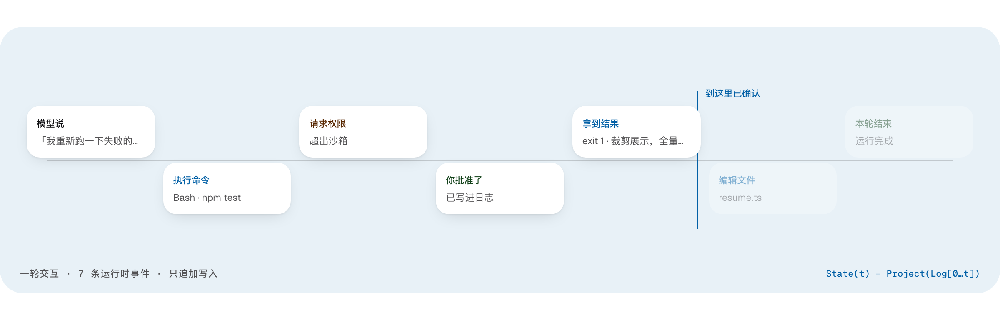

<!--
  Licensed to the Apache Software Foundation (ASF) under one
  or more contributor license agreements.  See the NOTICE file
  distributed with this work for additional information
  regarding copyright ownership.  The ASF licenses this file
  to you under the Apache License, Version 2.0 (the
  "License"); you may not use this file except in compliance
  with the License.  You may obtain a copy of the License at

      http://www.apache.org/licenses/LICENSE-2.0

  Unless required by applicable law or agreed to in writing,
  software distributed under the License is distributed on an
  "AS IS" BASIS, WITHOUT WARRANTIES OR CONDITIONS OF ANY
  KIND, either express or implied.  See the License for the
  specific language governing permissions and limitations
  under the License.
-->

<h1 align="center">
   Apache Maka (Incubating)
</h1>

<h3 align="center">Apache Maka（孵化中）是一个高性能的 Agent 工作台，并完整记录它做过的每一件事。</h3>

<p align="center">
  <a href="https://maka.apache.org/zh-CN/">官网</a> ·
  <a href="./docs/README.md">文档</a> ·
  <a href="https://maka.apache.org/zh-CN/downloads/">下载</a> ·
  <a href="./README.md">English</a>
</p>

<p align="center">
  <a href="https://github.com/apache/maka/stargazers"></a>
  <a href="./LICENSE"></a>
  
</p>

<picture>
  <source media="(prefers-color-scheme: dark)" srcset="./.github/assets/readme-hero.zh-CN.dark.png" />
  
</picture>

## 什么是 Maka

Agent harness 的本职就是把任务做完。衡量它的标准只有一条：完成了多少，花了多少。我们公开每一次运行：同一个模型，同一个官方验证器，逐任务的完整记录。

- **靠测量，不靠宣称。** Maka 与其他 harness 在同一个模型、同一个官方验证器下对比跑分，每份报告都附逐任务结果，见 [`docs/eval/`](./docs/eval)。
- **日志就是运行时。** 每条模型消息、工具调用、权限决定和终止都是一条只追加的 RuntimeEvent。界面、下一轮 prompt 和崩溃恢复都是这份日志的投影，从不是唯一副本。旧的工具输出可以不进下一轮 prompt，但不会从日志里消失。
- **数据在你的机器上，模型由你接。** 会话、设置和运行记录保存在本机；云 API、本地模型或兼容网关都可以。
- **一个 Runtime Host。** Desktop、TUI 和 CLI、Eval 都是瘦客户端，执行只由这一个 Runtime Host 说了算；Eval 只负责实验和分数。

[官网](https://maka.apache.org/zh-CN/)演示了日志中的一轮，并链接到公开的运行结果。系统地图见 [ARCHITECTURE.zh-CN.md](./ARCHITECTURE.zh-CN.md)。

## 获取 Maka

**Apache Releases**：Maka 尚未发布过 Apache release。发布之后，带签名的源码包才是正式 release，其他渠道分发的包属于便利构建。候选版本的准入标准、签名路径与验包步骤见[下载页面](https://maka.apache.org/zh-CN/downloads/)与 [`.github/ASF_SOURCE_RELEASE.md`](./.github/ASF_SOURCE_RELEASE.md)。

**Desktop Nightly**：每天从 `main` 构建，面向开发者和测试者，覆盖 macOS 的 Apple Silicon 与 Intel、Windows x64、Linux x64 与 arm64；Windows 和 Linux 构建是未签名预览。它不是 ASF release，不适合生产使用。安装包与平台状态见[下载页面](https://maka.apache.org/zh-CN/downloads/)。

**从源码构建**：要从源码 checkout 直接构建并运行 Desktop、TUI 或 CLI，见下方的[从源码构建](#从源码构建)一节。

## 从源码构建

### 环境要求

- Node.js 22.19 或更高（CI 使用 Node.js 24）；
- npm（仓库 lockfile 和 scripts 以 npm 为准，`packageManager` 当前为 npm 11）；
- Git；
- `ripgrep`，供 Runtime 的 `Grep` 工具使用。

### 启动 Desktop

```sh
git clone https://github.com/apache/maka.git
cd maka
npm ci
npm run dev
```

`npm run dev` 启动带 HMR 的 Desktop 开发环境。需要先完整构建再启动 Electron 时使用：

```sh
npm run dev:full
```

开发 Direct Peer 和 Peer Mesh 还需要 Rust stable 1.98 或更高版本及平台 linker
（macOS 使用 Xcode Command Line Tools，Windows 使用 MSVC Build Tools）。使用 Peer 开发入口，
Desktop 会在启动前构建原生 addon：

```sh
npm run dev:peer       # HMR
npm run dev:full:peer  # 完整构建
```

如果安装时设置过 `ELECTRON_SKIP_BINARY_DOWNLOAD=1`，启动前需要补装 Electron 平台二进制：

```sh
node node_modules/electron/install.js
```

### 第一次运行

Maka 不内置共享模型账号。第一次打开时：

1. 进入 `设置 → 模型`；
2. 添加一个 API、本地模型或已经接通的账号连接；
3. 测试连接并选择默认模型；
4. 返回工作台开始任务。

应用会根据真实连接状态区分“已配置”“可发送”和“实验入口”，不会把没有接入 Runtime 的账号展示成可用模型。

## 使用终端入口

公共 npm 包的安装和使用方式请查看 [CLI 中文指南](./packages/cli/README.zh-CN.md)。下面的命令
用于从源码 checkout 运行开发版 CLI。

先构建 workspace：

```sh
npm run build
```

然后可以启动 TUI 或执行单次 Turn：

```sh
npm run cli:dev
npm run cli:dev -- run "总结当前仓库并指出最重要的风险"
npm run cli:dev -- run --graph "并行实现两个切片，完成集成，然后独立审查"
npm run cli:dev -- --help
```

TUI 同时支持 `/graph on`、`/graph off` 和 `/graph <任务>`。非交互
`--graph` 会等待持久化 Graph 真正结束，再输出 supervisor 的最终结果。
Graph 的 implementation operator 使用隔离的 Git worktree，因此源项目必须是干净的
Git worktree。

仓库 CLI 使用与开发版 Desktop 构建相同的 `Maka Dev` profile；发布版 `maka` 二进制仍使用
`Maka` profile，二者不会自动复制或同步。评测 spec 和 adapter 位于 [`packages/eval`](./packages/eval)。

## 架构

Maka 后端可以用一条主线概括：

```text
Desktop / TUI / CLI → Runtime Host → SessionManager → AgentRun
                                             ↓
                         Model + Tool Runtime → Runtime Event Log
                                             ↓
                              Context / Session / UI projections

Experiment → Cells → Attempts → Results
                    ↓
       Runtime Host 执行 Maka subjects
```

从 [ARCHITECTURE.zh-CN.md](./ARCHITECTURE.zh-CN.md) 开始阅读。它提供总体架构图、代码边界、按问题组织的阅读路径，以及 `docs/architecture/` 下深度文章的链接。

## 仓库结构

```text
apps/desktop/          Electron main / preload / React renderer

packages/core/         Session、Event、Permission、Connection 等纯 contracts
packages/storage/      SQLite 运行状态、配置与 payload stores
packages/mcp/          与提供商无关的 Model Context Protocol 客户端集成
packages/runtime/      AgentRun、模型适配、工具、上下文和恢复
packages/runtime-host/ 单一所有者的 Runtime Host 生命周期、协议和客户端启动
packages/eval/         Experiment cell、attempt、result 与 executor/subject adapter
packages/computer-use/ Computer Use 后端选择、Host 生命周期和协议适配
packages/cli/          TUI 和非交互 CLI
packages/ui/           共享对话、Markdown、Artifact 与 UI primitives
native/                Rust：Runtime Host 的 direct-peer addon 与 gitoxide helper
website/               maka.apache.org 的 Astro 源码

docs/                  架构、产品、安全、隐私和测试契约
scripts/               Build hygiene、视觉检查、smoke 和 release helpers
skills/                随仓库分发的 agent skill
patches/               安装时应用到 npm 依赖的补丁
experiments/           平台实验，目前是 Windows 沙箱 smoke 脚本
```

## 本地数据与恢复

Workspace 数据默认放在 Electron `userData` 下：

```text
<Electron userData>/workspaces/default/
  runtime.sqlite
  connection-catalog.json
  credential-vault.json
  settings.json
  artifacts/
```

- API key 一类的机密存在本地明文文件（`credential-vault.json`），只有你的系统账号能读。界面进程拿不到明文。
- 写文件、跑 Shell 的工具必须先过沙箱边界。
- `runtime.sqlite` 是当前生效的那份记录。更早的 JSONL transcript 和 Electron `safeStorage` 凭据不会导入；升级后会话可能是空的，那些凭据需要重新填写。
- 中断回合的续跑默认关闭。只有设置 `MAKA_RUNTIME_SAFE_BOUNDARY_RESUME=1` 才会打开 Desktop **安全恢复**、CLI `/resume` 和启动时自动续跑——这些路径会真的请求模型、消耗 token。

细节见 [SECURITY.md](./SECURITY.md)、[隐私](./docs/workspace-privacy-context.md)、[续跑](./docs/architecture/runtime-resume-architecture.zh-CN.md)。

## 开发与验证

提交改动前请先阅读 [CONTRIBUTING.zh-CN.md](./CONTRIBUTING.zh-CN.md)。

常用仓库级命令：

```sh
npm run build
npm run typecheck
npm test
npm run check:release
```

针对单个 workspace：

```sh
npm --workspace @maka/runtime run test:dist
npm --workspace @maka/eval run test:dist
npm --workspace @maka/desktop run test:dist
```

用 `refresh:model-metadata` 从 models.dev 获取当前目录、更新仓库内快照，并重新生成派生的 TypeScript 文件。已提交的模型、能力、provider override 或 pricing 字段消失时，refresh 会 fail closed；审查确认上游确实有意删除后，用 `npm run refresh:model-metadata -- --accept-upstream-removals` 显式确认。`sync:model-metadata` 刻意保持离线，只会从已提交快照重新生成这些文件。访问路径特有的 override 写在 `model-metadata.ts`，不要手动修改生成文件。

```sh
npm run refresh:model-metadata
npm --workspace @maka/core run test:dist
```

Desktop 的真实窗口与视觉验证：

```sh
npm --workspace @maka/desktop run e2e
npm --workspace @maka/desktop run smoke:real-window
```

提交代码前至少运行与改动范围相称的 typecheck、build 和 focused tests，并执行 `git diff --check`。

## 文档入口

- [官网](https://maka.apache.org/zh-CN/)
- [文档索引与权威来源说明](./docs/README.md)
- [后端架构总览](./ARCHITECTURE.zh-CN.md)
- [产品设计](./DESIGN.md)
- [贡献指南](./CONTRIBUTING.zh-CN.md)
- [安全政策](./SECURITY.md)
- [DeepWiki](https://deepwiki.com/apache/maka)，第三方 AI 生成文档，不由项目维护

## 开源协议

Maka 使用 [Apache License 2.0](./LICENSE) 开源，归属信息见
[NOTICE](./NOTICE)。第三方组件仍分别适用其自身的许可证与声明。

Apache Maka、Maka、Apache、Apache 羽毛标志和 Apache Maka 项目标志是 Apache 软件基金会的注册商标或商标。

> [!NOTE]
> Apache Maka (Incubating) 是一个正在 Apache 软件基金会（ASF）孵化的项目，由 Apache Incubator PMC 主办。所有新接受的项目都必须经过孵化，直到进一步审查表明其基础设施、沟通方式和决策流程已经稳定到与其他成功的 ASF 项目一致的程度。孵化状态未必反映代码的完成度或稳定性，但它确实表明该项目尚未得到 ASF 的完全认可。项目当前已知的问题记录在 [DISCLAIMER-WIP](./DISCLAIMER-WIP)（以英文原文为准）。

> [!IMPORTANT]
> Maka 仍在活跃开发中。数据格式、CLI 和实验能力仍可能变化。
